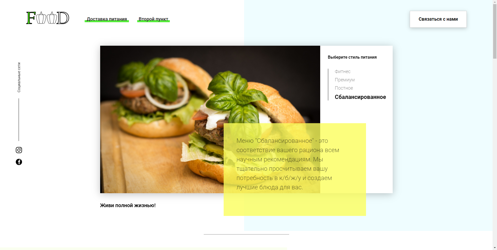

# Food

The Food Project is a website for selling meal plans.

Here you can choose a meal plan based on your preferences and calories. The site has a calorie calculator.

Menu cards with prices are generated from a database stored on the server.

When ordering, the user data stored in the database on the server.

All interactive elements are created using **JavaScript**, without the use of libraries and frameworks
