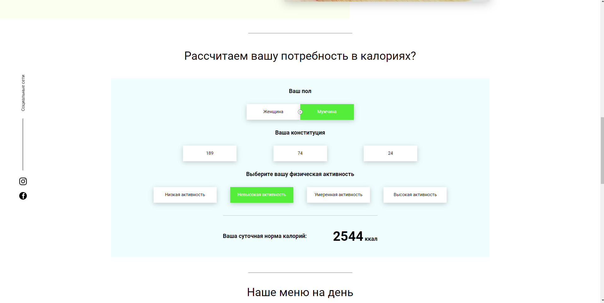

# Food

The Food Project is a website for selling meal plans.

Here you can choose a meal plan based on your preferences and calories. The site has a calorie calculator.

Menu cards with prices are generated from a database stored on a server.

When ordering, user data is stored in a database on a server.

The site also has a countdown timer until the end of the discount.

All interactive elements are created using **JavaScript**, without the use of libraries and frameworks.
The site is assembled from separate modules using webpack.
